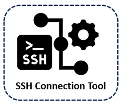
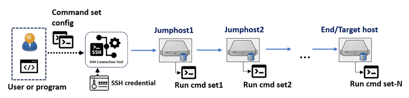
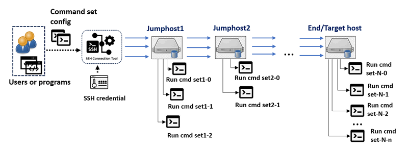
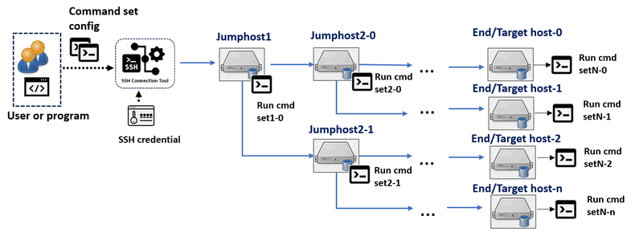
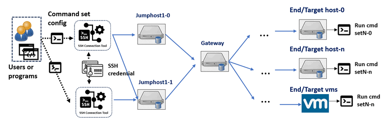
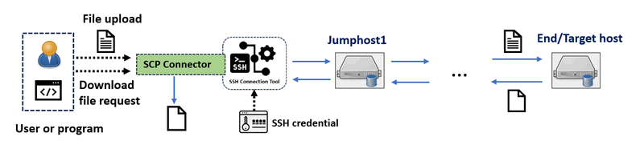
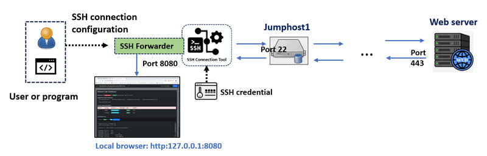

# SSH Connection Tools



**Program Design Purpose**: We aim to create a Python SSH tool library that facilitates SSH communication, SCP file transfer, and SSH port forwarding through multiple jump hosts in an SSH tunnel chain. The library is designed to provide a simple API for establishing nested SSH tunnel connections through multiple jump hosts with customizable TCP ports. This allows users or their programs to automate SSH tasks such as:

1. Batch processing SSH connection tasks, such as connecting to multiple servers' IPMI interfaces to collect operational data.
2. Starting hundreds of threads to SSH into target services for load and stress testing.
3. Transferring files between different servers using SCP.
4. Forwarding ports from various servers to the local host, enabling users to access multiple web interfaces in a cluster.

```
# Created:     2022/08/01
# Version:     v_0.1.3
# Copyright:   Copyright (c) 2024 LiuYuancheng
# License:     MIT License  
```

**Table of Contents**

[TOC]

------

### Introduction

This project provides three main modules to help users automate SSH tasks, including running multiple commands on different hosts, transferring files between servers via SCP, and forwarding traffic to the local host via SSH.

1. **SSH-Connector**: This module creates an SSH connection tunnel tree, allowing users to access and execute commands on different hosts through multiple jump hosts in a cluster.
2. **SCP-Connector**: This module facilitates file transfers (uploading and downloading) between nodes through the SSH tunnel tree.
3. **SSH-Forwarder**: This module enables port forwarding, directing communication traffic from a node in the network to the user's local machine through the SSH tunnel tree.

We use the libraries [paramiko](https://www.paramiko.org/) and [python-scp](https://pypi.org/project/scp/) to implement these modules. The project also includes a test case module and usage examples, such as a target SSH load testing program.


#### SSH Connector Introduction

The SSH Connector module is designed to build an SSH connection tunnel tree/chain, enabling users to access and execute commands on different target node through multiple jump hosts in a cluster. The commands will be added in a queue and execution sequence will be FIFO. The connectors can be combined together to build SSH tunnel chain. It can be applied in the following scenarios:

##### Scenario01: Linear Connection Through Single SSH Tunnel

- **Description**: User/Program can pass a set of SSH commands to the connector and run these commands on different hosts in the SSH tunnel chain, either in parallel or in sequence. Each account will be used to log in to the hosts once. The workflow is shown below:



- **Use case**: Automated SSH command execution and result collection.

- **Connector configuration**:

| Input SSH command list/set | Input SSH credential      | Thread        | SSH tunnel    |
| -------------------------- | ------------------------- | ------------- | ------------- |
| One list/set for each host | One account for each host | Single thread | Single tunnel |


##### Scenario 02: Linear Connections Through Multiple SSH Tunnels

- **Description**: Users can pass different sets of SSH commands to the connector and run these commands in parallel threads, using different accounts on the hosts in the SSH tunnel chain. If use single account, each account will be used to log in to the hosts multiple times. The workflow is shown below:



- **Use Case**: Cluster node stress testing or traffic generation.
- **Connector Configuration**:

| Input SSH command list/set      | Input SSH credential           | Thread           | SSH tunnel       |
| ------------------------------- | ------------------------------ | ---------------- | ---------------- |
| Multiple list/set for each host | Multiple account for each host | Multiple threads | Multiple tunnels |


##### Scenario 03: Tree Connection Through Multiple SSH Tunnels

- **Description**: Users/Programs can use the connector to build an SSH tunnels tree and run different sets of SSH commands with parallel threads.  The workflow is shown below:



- **Use case**: Accessing cluster servers' management interfaces (ILO or IPMI) to collect data.
- **Connector Configuration**:

| Input SSH command list/set      | Input SSH credential      | Thread           | SSH tunnel       |
| ------------------------------- | ------------------------- | ---------------- | ---------------- |
| Multiple list/set for each host | One account for each host | Multiple threads | Multiple tunnels |


##### Scenario 04: Mixed Connection Through Multiple SSH Tunnels

- **Description**: Users can use multiple SSH connectors to build both SSH tunnel chains and trees to run different sets of SSH commands in parallel threads on different hosts as shown the work flow below:



- **Use case**: Load testing for an SSH service, such as a CTF hands-on VM service cluster.
- **Connector Configuration:**

| Input SSH command list/set      | Input SSH credential            | Thread           | SSH tunnel       |
| ------------------------------- | ------------------------------- | ---------------- | ---------------- |
| Multiple list/set for each host | Multiple accounts for each host | Multiple threads | Multiple tunnels |


#### SCP Connector Introduction

The SCP connector module is an extension module of the SSH connector, it will use SSHconnector to create the SSH tunnel first then use python-scp module to upload/download file from the program running host to the target server through a jump hosts chain.

The SCP connector workflow is shown below:



#### SSH Forwarder Introduction 

The SSH forwarder module is an extension module of the SSH connector, it will use SSHconnector to create the SSH tunnel first then forward a remote host port through several jump hosts to a local/other-remote host's port (Assume the firewall between only allows port 22 open). Such as connect a port of a remote  web server (i.e. 80/443/8080) where only SSH port (usually port 22)  is reachable. Then the user can access the web via URL `http(s)://127.0.0.1:<local Port Number>` . 

The SSH Forwarder workflow is shown below:




------

System Design 