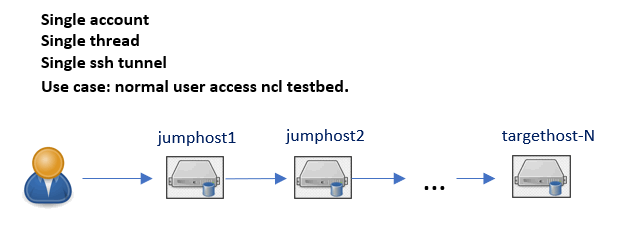
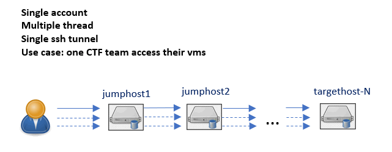

# SSH Connection Tools


**Program Design Purpose**: We want to create a python SSH tool lib which can do SSH communication, SCP file transfer and SSH port forwarding through multiple jump hosts SSH tunnel chain. The lib is design to provide a simple way with API to create nested SSH tunnel connection through jump hosts with an editable TCP port for user or their program to automated finish the SSH tasks such as:

1. Batching process the SSH connection running command tasks such as connect to several server's IPMI to collect server operation data. 
2. Start hundreds thread to SSH connect to the target service to do the load and Stress. 
3. SCP transfer file among different servers. 
4. Forward different server's port to local host for user to check multiple web interface host in a cluster. 

```
# Created:     2022/08/01
# Version:     v_0.1.3
# Copyright:   Copyright (c) 2024 LiuYuancheng
# License:     MIT License  
```

**Table of Contents**

[TOC]

------

### Introduction

This project provide 3 main modules to help user to automated SSH run multiple commands on different host, SCP file among different servers and SSH forward traffic to the local host. 

1. **SSH-Connector**: The SSH connector is aimed to create a SSH connector to build a ssh connection tunnel tree to let the user can access and execute command on different hosts through multiple jump hosts in a cluster. 
2. **SCP-Connector**: The SCP connector is used to do the file transfer(upload/download) files among different node through the SSH  tunnel tree. 
3. **SSH-Forwarder**: The SSH forwarder is aimed to help do the ssh port forward to forward the communication traffic from a node in the network to the user's local machine through the SSH tunnel tree. 

We use the lib [paramiko](https://www.paramiko.org/) and [python-scp](https://pypi.org/project/scp/) to implement the modules. 


#### SSH Connector Introduction


The ssh connector be used for implementing below tasks/scenario. 

1. Single user uses one account to access the targe host through several jump hosts: 

   

2. Multiple users use same account to access the same target host through several jump hosts:

   

3. Single user use different account to access multiple targe hosts through jump hosts:

   

4. Multiple user use different accounts to access multiple target hosts through different/same jump hosts:

   

5. -- 