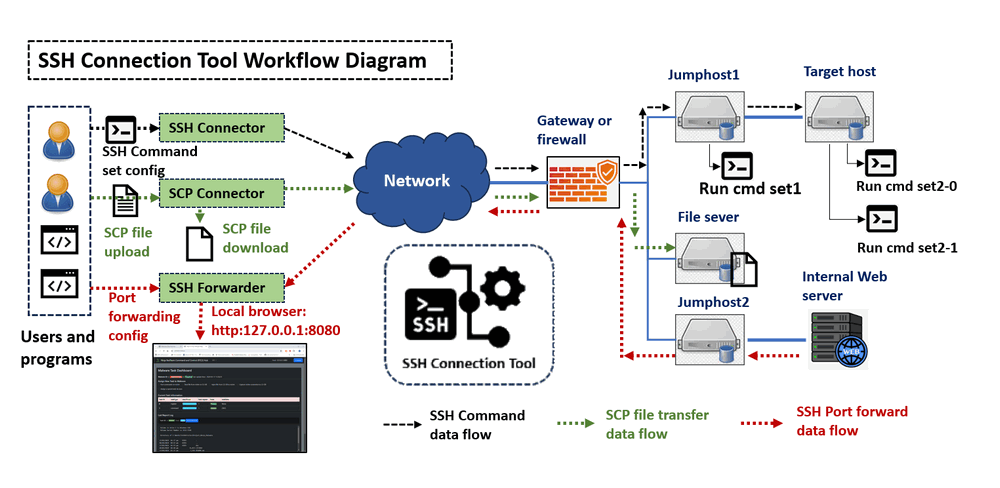
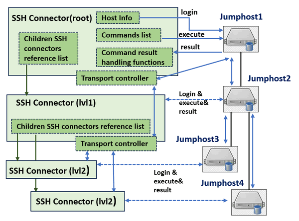

# SSH Connection Tools


**Program Design Purpose**: We aim to create a simple Python SSH tool library that facilitates SSH communication, SCP file transfer, and SSH port forwarding through multiple jump hosts in an SSH tunnel chain. The library is designed to provide a simple API for establishing nested SSH tunnel connections through multiple jump hosts with customizable TCP ports. This allows users or their programs to automate SSH tasks such as:

1. Batch processing SSH connection tasks, such as connecting to multiple servers' IPMI interfaces to collect operational data.
2. Starting hundreds of threads to SSH into target services for load and stress testing.
3. Transferring files between different servers using SCP.
4. Forwarding ports from various servers to the local host, enabling users to access multiple web interfaces in a cluster.

The system workflow is shown below:



```
# Created:     2023/08/01
# Version:     v_0.1.3
# Copyright:   Copyright (c) 2024 LiuYuancheng
# License:     MIT License  
```

**Table of Contents**

[TOC]

- [SSH Connection Tools](#ssh-connection-tools)
    + [Introduction](#introduction)
      - [SSH Connector Introduction](#ssh-connector-introduction)
        * [Scenario01: Linear Connection Through Single SSH Tunnel](#scenario01--linear-connection-through-single-ssh-tunnel)
        * [Scenario 02: Linear Connections Through Multiple SSH Tunnels](#scenario-02--linear-connections-through-multiple-ssh-tunnels)
        * [Scenario 03: Tree Connection Through Multiple SSH Tunnels](#scenario-03--tree-connection-through-multiple-ssh-tunnels)
        * [Scenario 04: Mixed Connection Through Multiple SSH Tunnels](#scenario-04--mixed-connection-through-multiple-ssh-tunnels)
      - [SCP Connector Introduction](#scp-connector-introduction)
      - [SSH Forwarder Introduction](#ssh-forwarder-introduction)
    + [Program Design](#program-design)
    + [Program Setup](#program-setup)
        * [Development Environment : Python 3.7.4+](#development-environment---python-374-)
        * [Additional Lib/Software](#additional-lib-software)
        * [Program File List](#program-file-list)
    + [Program Usage](#program-usage)
      - [SSH Connector Usage](#ssh-connector-usage)
      - [SCP Connector Usage](#scp-connector-usage)
      - [SSH Forwarder Usage](#ssh-forwarder-usage)
    + [Problem and Solution](#problem-and-solution)


------

### Introduction

This project provides three main modules to help users automate SSH tasks, including running multiple commands set on different cluster hosts, transferring files between servers via SCP, and forwarding traffic to the local host via SSH. 

1. **SSH-Connector**: This module creates an SSH connection tunnel tree/chain, allowing users to access and execute commands on different hosts through multiple jump hosts in a cluster.
2. **SCP-Connector**: This module facilitates file transfers (uploading and downloading) between nodes through the SSH tunnel tree/chain.
3. **SSH-Forwarder**: This module enables port forwarding, directing communication traffic from a node in the network to the user's local machine through the SSH tunnel tree/chain.

We use the python libraries [paramiko](https://www.paramiko.org/) and [python-scp](https://pypi.org/project/scp/) to implement these modules. The project also includes test case modules and usage examples, such as a target SSH load testing program.


#### SSH Connector Introduction

The SSH Connector module is designed to build an SSH connection tunnel tree/chain, enabling users to access and execute commands on different target nodes through multiple jump hosts in a cluster. The commands will be added in a queue and the execution sequence will be FIFO. The connectors can be combined together to build SSH tunnel chain. It can be applied in the following scenarios:

##### Scenario01: Linear Connection Through Single SSH Tunnel

- **Description**: User/Program can pass a set of SSH commands to the connector and run these commands on different hosts in the SSH tunnel chain, either in parallel or in sequence. Each account will be used to login to the hosts once. The workflow is shown below:


` Figure-01: SSH Connector linear connection through single SSH tunnel, version v0.1.3 (2024)`

- **Use case**: Automated SSH command execution and result collection.

- **Connector configuration**:

| Input SSH command list/set | Input SSH credential      | Thread        | SSH tunnel    |
| -------------------------- | ------------------------- | ------------- | ------------- |
| One list/set for each host | One account for each host | Single thread | Single tunnel |


##### Scenario 02: Linear Connections Through Multiple SSH Tunnels

- **Description**: Users can pass different sets of SSH commands to the connector and run these commands in parallel threads, using different accounts on the hosts in the SSH tunnel chain. If use single account, each account will be used to log in to the hosts multiple times. The workflow is shown below:


` Figure-02: SSH Connector Linear Connections Through Multiple SSH Tunnels , version v0.1.3 (2024)`

- **Use Case**: Cluster node stress testing or traffic generation.
- **Connector Configuration**:

| Input SSH command list/set      | Input SSH credential           | Thread           | SSH tunnel       |
| ------------------------------- | ------------------------------ | ---------------- | ---------------- |
| Multiple list/set for each host | Multiple account for each host | Multiple threads | Multiple tunnels |


##### Scenario 03: Tree Connection Through Multiple SSH Tunnels

- **Description**: Users/Programs can use the connector to build an SSH tunnels tree and run different sets of SSH commands with parallel threads. The workflow is shown below:


` Figure-03: SSH Connector Tree Connection Through Multiple SSH Tunnels, version v0.1.3 (2024)`

- **Use case**: Accessing cluster servers' management interfaces (ILO or IPMI) to collect data.
- **Connector Configuration**:

| Input SSH command list/set      | Input SSH credential      | Thread           | SSH tunnel       |
| ------------------------------- | ------------------------- | ---------------- | ---------------- |
| Multiple list/set for each host | One account for each host | Multiple threads | Multiple tunnels |


##### Scenario 04: Mixed Connection Through Multiple SSH Tunnels

- **Description**: Users/Programs can use multiple SSH connectors to build both SSH tunnel chains and trees to run different sets of SSH commands in parallel threads on different hosts. The workflow is shown below:


` Figure-04: SSH Connector Mixed Connection Through Multiple SSH Tunnels, version v0.1.3 (2024)`

- **Use case**: Load testing for a SSH service, such as a CTF hands-on VM service cluster stress test.
- **Connector Configuration:**

| Input SSH command list/set      | Input SSH credential            | Thread           | SSH tunnel       |
| ------------------------------- | ------------------------------- | ---------------- | ---------------- |
| Multiple list/set for each host | Multiple accounts for each host | Multiple threads | Multiple tunnels |


#### SCP Connector Introduction

The SCP Connector module extends the functionality of the SSH Connector. It first uses the SSH Connector to establish an SSH tunnel, then employs the `python-scp` module to upload or download files from the local host to the target server through a chain of jump hosts.

The SCP Connector workflow is illustrated below:


` Figure-05: SCP Connector workflow diagram, version v0.1.3 (2024)`


#### SSH Forwarder Introduction 

The SSH Forwarder module extends the functionality of the SSH Connector. It uses the SSH Connector to create an SSH tunnel, then forwards a remote host port through several jump hosts to a local or other remote host's port (assuming the firewall only allows port 22 to be open). This is useful for accessing services on a remote web server (e.g., ports 80, 443, or 8080) when only the SSH port (usually port 22) is reachable. Users can then access the web service via the URL `http(s)://127.0.0.1:<local Port Number>`.

The SSH Forwarder workflow is illustrated below:


` Figure-05: SSH Forwarder workflow diagram, version v0.1.3 (2024)`


------

### Program Design 

The SSH connector design follows a linked list iteration pattern, with each connector matching to a specific host. The connector workflow is depicted below:



` Figure-06: SSH Connector workflow diagram, version v0.1.3 (2024)`

Each SSH Connector object includes four main sets of parameters:

- **Host Information**: This includes the connected host's IP address, username, and login credentials.
- **Command List and Result Handling Function**: A list of commands to be executed and reference list to the function that processes the command results. (Each command line can match one function)
- **Children SSH Connectors List**: A list of references to the next level of connectors.
- **Transport Controller**: Manages the transport of the child connector's SSH host information and command execution to the parent, forwarding it to the appropriate host through the SSH tunnel.


------

### Program Setup

##### Development Environment : Python 3.7.4+

##### Additional Lib/Software 

| Lib Module   | Version | Installation           | Lib link                                 |
| ------------ | ------- | ---------------------- | ---------------------------------------- |
| **Paramiko** | 2.11.0  | `pip install paramiko` | https://www.paramiko.org/installing.html |
| **SCP**      | 0.14.4  | `pip install scp`      | https://pypi.org/project/scp/            |

##### Program File List

| Program File                          | Execution Env | Description                           |
| ------------------------------------- | ------------- | ------------------------------------- |
| `src/ SSHconnector.py`                | python 3      | Main SSH connector lib module.        |
| `src/ SCPconnector.py`                | python 3      | Main SCP connector lib module.        |
| `src/ SCPforwarder.py`                | python 3      | Main SSH forward function lib module. |
| `src/testCases/ sshConnectorTest.py`  | python 3      | SSH connector function test module.   |
| `src/testCases/ scpConnectorTest.py`  | python 3      | SCP connector function test module.   |
| `src/testCases/ scpForwarederTest.py` | python 3      | SSH forwarder function test module.   |
| `src/example/ loadTester.py `         |               | SSH connection stress test program.   |


------

### Program Usage


#### SSH Connector Usage

To run the module directly for SSH connections, execute the module and follow the instructions to input the parameters:

```
python SSHconnector.py
```

To use the module in your program, follow these steps or refer to the example in the test case `sshConnectorTest.py`:

1. Initialize all the SSH connectors.
2. Create the SSH tunnel chain using the `addChild()` function.
3. Add the commands you want to execute and the result handler function in each host's related connector using the `addCmd()` function.
4. Initialize the SSH tunnel chain using the root connector's `InitTunnel()`.
5. Run all the commands in every connector by calling the root connector's `runCmd()` function.
6. After completion, call the root connector's `close()` to close all the SSH sessions.

Example:

```python
mainInfo = ('<ipaddress>', '<userA>', '<userApassword>')
jumpInfo = ('<ipaddress>', '<userB>', '<userApassword>')

def test1RplyHandleFun(replyStr):
    print("Got reply: %s" %str(replyStr))

mainHost = sshConnector(None, mainInfo[0], mainInfo[1], mainInfo[2])
tgtHost = sshConnector(mainHost, jumpInfo[0], jumpInfo[1], jumpInfo[2], port=jumpInfo[3])
tgtHost.addCmd('pwd', None)
mainHost.addChild(tgtHost)
mainHost.addCmd('ifconfig', test1RplyHandleFun)
mainHost.InitTunnel()
mainHost.runCmd(interval=0.1)
mainHost.close()
```


#### SCP Connector Usage

To run the module directly for SCP file transfers, execute the module and follow the instructions to input the parameters: 

```
python SCPconnector.py
```

To use the module in your program, follow these steps or refer to the example in the test case `scpConnectorTest.py`:

1. Initialize all the SSH connectors with the target host and jump host chain information.
2. Call the `uploadFile()` function to SCP a file from the local system to the target node's specific folder.
3. Call the `downloadFile()` function to SCP a file from the remote node to the local system.

Example:

```python
destInfo = ('<ipaddress>', '<userA>', '<userApassword>')
jumphosts = [('<ipaddress>', '<userA>', '<userApassword>'), ('<ipaddress>', '<userA>', '<userApassword>')]
scpClient = scpConnector(destInfo, jumpChain=jumphosts, showProgress=True)
scpClient.uploadFile('scpTest.txt', '~/scpTest2.txt')
scpClient.downFile('~/scpTest2.txt')
scpClient.close()
```


#### SSH Forwarder Usage

To run the module directly for SSH port forwarding, execute the module and follow the instructions to input the parameters:

```
python SSHforwarder.py
```

To use the module in your program, follow these steps or refer to the example in the test case `sshForwarderTest.py`:

1. Initialize the forwarder object by passing in the parameters.
2. Add the jump host information (address, user, password) in sequence from the local user to the target remote host.
3. Call the `startForward()` function to begin port forwarding.
4. Open a browser with the URL `http(s)://127.0.0.1:<local Port Number>` to access the web page.

Example:

```python
localport = 8000
remoteHost = ('<target ipaddress>', 8080)    
forwarder = localForwarder(localport, remoteHost[0], remoteHost[1])
jumphost = {  	'address'	: '<ipaddress>',
				'user'		: '<userA>',
				'password'	: '<userApassword>'
}
forwarder.addNextJH(jumphost['address'], jumphost['user'], jumphost['password'])
print(forwarder.getJsonInfo())
forwarder.startForward()
```


------

### Problem and Solution

If you got any problem or bug during the usage, please refer to `doc/ProblemAndSolution.md` or issue page to check whether there is any similar problem and we will provide the solution. 


------

>  Last edit by LiuYuancheng (liu_yuan_cheng@hotmail.com) at 30/05/2024, if you have any problem please free to message me.